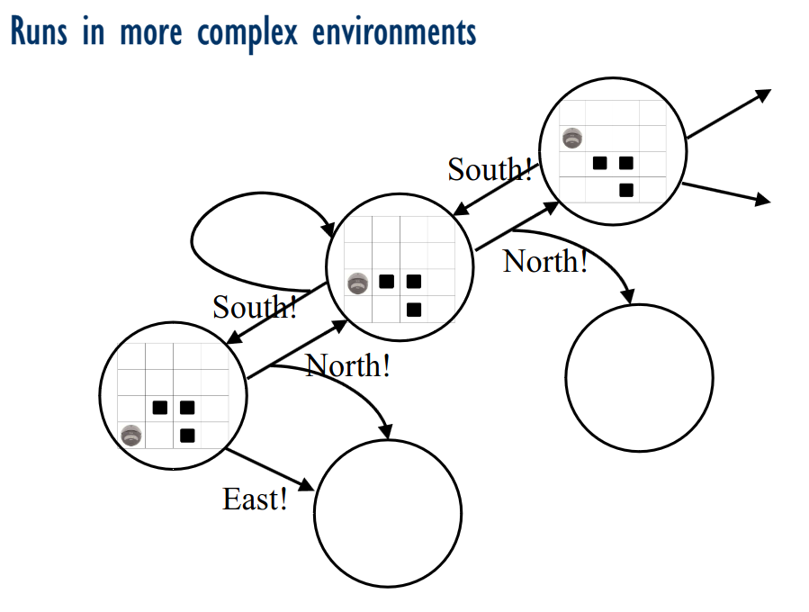
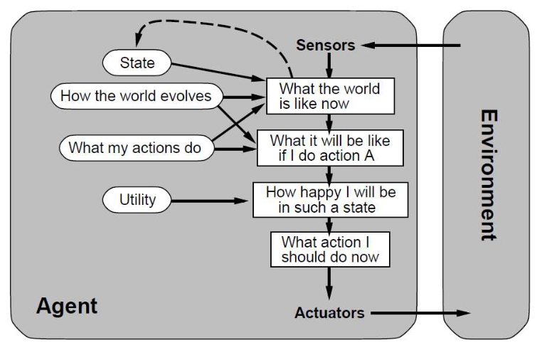

- Agents:
	- Proactive, Reactive, Autonomous, Social
	- Think of as the software behind a robot
	- May or may not do what you want it do, objects with attitude
	- Intelligent Agents:
		- Environment, Sensors, Effectors
		- Human Agent:
			- Environment: The Physical World
			- Sensors: Eyes, Ears, Skin, Taste buds, etc.
			- Effectors: Hands, Fingers, Arms, Elbows, voice, etc.
		- Self Driving Car:
			- Environment: Roads
			- Sensors: GPS, Cameras, Microphone, Touch sensors, LIDAR
			- Effectors: Wheels, Horn, Lights, Windscreen, Washers
			- Road Laws encoded as flexible rules as they may need to be broken on occasion.
			- For each decision made you will need to:
				- Identify all possible alternative options
				- Compare the options by some metric
				- Decide on the best option
				- Execute the option
				- Do it fast enough to be feasible
	- Rational Agents:
		- Acting logically given the sensory information you are equipped with.
		- Finite resources.
		- Not necessarily perfect.
		- Takes actions based on sensors using effectors which effects the environment.
	- Simple Agents:
		- Given a set of rules and inputs will produce specific outputs.
		- Rakes information from the environment and uses if else rules to execute actions based on the information.
	- Environments:
		- Static Environments: Remains unchanged except by the agent's own actions
		- Dynamic Environments: Other Processes change the environment in ways beyond the control of the agent
		- Discrete Environments: Finite Number of actions and precepts
		- Continuous Environments: Infinite Number of actions and precepts
	- Run of an agent in an environment:
		- `s0,a1,s1,a2,s2,a3,s3...`
		- `s` represents a state and `a` represents an action
		- Difference in states may not only be in results of our agent such as in a dynamic environment
		- Here is an example of a run that is more complex with multiple paths:
		  
		- Simple agents cant typically process more advanced situations. You need to add consequences of actions and goals towards actions.
		- Here is an example of what a more complex agent might look like:
		  
		- Goals may conflict and there may be different ways of achieving a goal. Utility will be a qualitative way of measuring how "good" any given option would be leading to a utility based agent
		- It is not always guaranteed the event will occur as we expect so we often use expected utility which is a measure of the utility * how likely the event is to happen written as $$E[U((s1)]$$