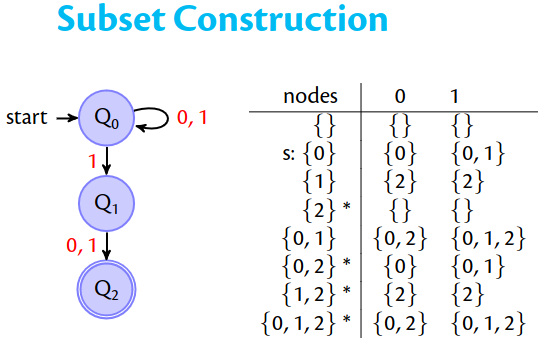
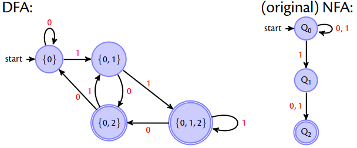
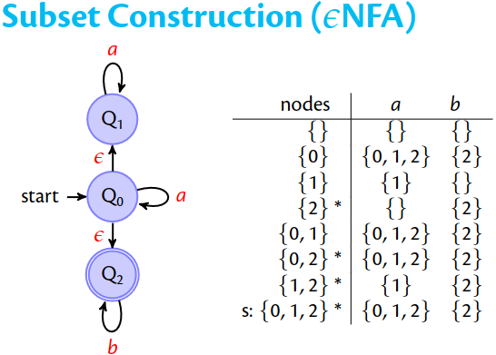
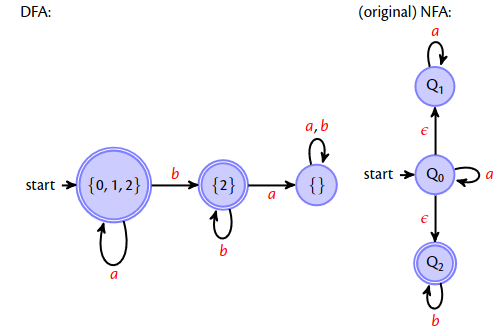
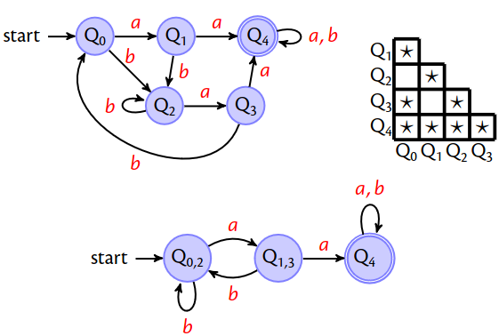
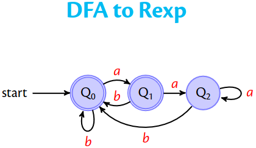
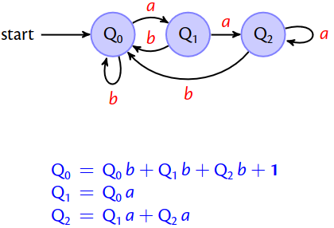
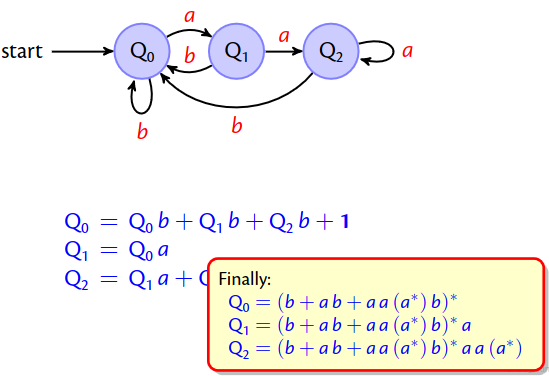

- Automata:
- A deterministic finite automaton,DFA, consists of
	- An alphabet $$\sum$$
	- A set of states $$Qs$$
	- One of these is the start state $$Q_0$$
	- Some states are accepting states $$F$$ and
	- There is the transition function $$\delta$$
	- which takes a state as an argument and a character and produces a new state; this function might not be everywhere defined => partial function :$$A(\sum,Qs,Q_0,F,\delta)$$
- A non-deterministic finite automaton,NFA, consists of
	- A set of states $$Qs$$
	- Some of these is the start states $$Qs_0$$
	- Some states are accepting states $$F$$ and
	- There is the transition relation $$\rho$$
- In \epsilon NFAs you have silent transitions to different parts of the tree
- Combining automata is done by linking the accept point from one automaton to the other automaton using \epsilon transitions
	- The starting states will be from the first automaton and the accepting states of the second automaton.
-
- 
- 
- {:height 399, :width 546}
- 
- DFA Minimisation #numlist
	- Take all pairs (q, p) with q \ne p
	- Mark all pairs that accepting and non-accepting states
	- For all unmarked pairs (q, p) and all characters c test whether (δ(q, c), δ(p, c)) are marked. If yes in at least one case, then also mark (q, p).
	- Repeat last step until no change.
	- All unmarked pairs can be merged.
- 
  id:: 65514041-3937-42c7-a742-03ef6d0cbe6e
-
- 
- 
- Arden's Lemma
	- If $$q=qr + s$$ then $$q = sr^*$$
- 
- Since q0 and q1 are accepting we add $Q_0$ and $Q_1$
-
- Regular Languages (3)
	- A language is regular if there exists a regular expression that recognises all its strings, or equivalently
	- A language is regular if there exists a deterministic finite automaton that recognises all its strings.
-