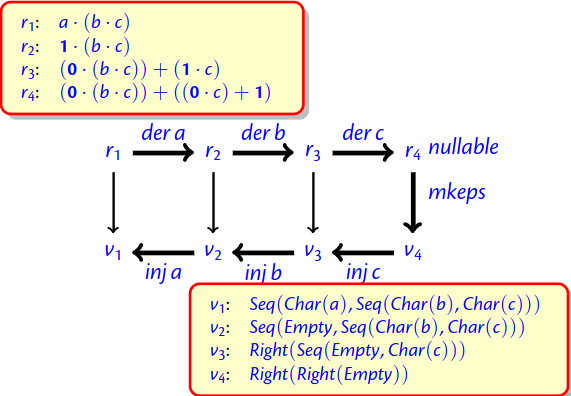

- Pulling out data from strings.
	- Specify keywords, whitespaces, identifiers, numbers, operations, comments.
	- Use this to split the string into tokens, and be able to parse
	- "if true then then 42 else +"
	- KEYWORD(if),
	  WHITESPACE,
	  IDENT(true),
	  WHITESPACE,
	  KEYWORD(then),
	  WHITESPACE,
	  KEYWORD(then),
	  WHITESPACE,
	  NUM(42),
	  WHITESPACE,
	  KEYWORD(else),
	  WHITESPACE,
	  OP(+)
	- remove whitespace and comments
	- KEYWORD(if),
	  IDENT(true),
	  KEYWORD(then),
	  KEYWORD(then),
	  NUM(42),
	  KEYWORD(else),
	  OP(+)
- POSIX: Two Rules
	- Longest match rule (“maximal munch rule”): The longest initial substring matched by any regular expression is taken as the next token.
	- Rule priority: For a particular longest initial substring, the first regular expression that can match determines the token.
- Regexes and Values
	- Regular expressions and their corresponding values:
		- r ::= 0
		  | 1
		  | c
		  | r1 · r2
		  | r1 + r2
		  
		  | r∗
		- v ::=
		  Empty
		  | Char(c)
		  | Seq(v1, v2)
		  | Left(v)
		  | Right(v)
		  | Stars []
		  | Stars [v1, . . . vn]
- 
- Finding a posix value for recognising the empty string
	- $$mkeps\ (1)\stackrel{def}{=} Empty$$
	- $$mkeps\ (r_1 + r_2)\stackrel{def}{=}$$
		- $$if\ nullable(r_1):\ then\ Left(mkeps(r_1))$$
		- $$else:\ Right(mkeps(r_2))$$
	- id:: 65524dac-bd1b-43c3-8b0f-ae9fc0eebe80
	  $$mkeps\ (r_1 + r_2)\stackrel{def}{=} Seq(mkeps(r_1),Seqmkeps(r_2))$$
	- $$mkeps\ (r_1 + r_2)\stackrel{def}{=} Stars[]$$
- Injection (adding a character to a value)
	- id:: 65524e01-438a-4b53-9a04-f1b03590db58
	  $$inj (c)\ c (Empty) \stackrel{def}{=} Char (c)$$
	- $$inj (r_1 + r_2)\ c (Left(v)) \stackrel{def}{=} Left(inj r_1 c v)$$
	- $$inj (r_1 + r_2)\ c (Right(v)) \stackrel{def}{=} Right(inj r_2 c v)$$
	- $$inj (r_1 · r_2)\ c (Seq(v_1, v_2)) \stackrel{def}{=} Seq(inj r_1 c v_1, v_2)$$
	- $$inj (r_1 · r_2)\ c (Left(Seq(v_1, v_2))) \stackrel{def}{=} Seq(inj r_1 c v_1, v_2)$$
	- $$inj (r_1 · r_2)\ c (Right(v)) \stackrel{def}{=} Seq(mkeps(r_1), inj r_2 c v)$$
	- $$inj (r^*)\ c (Seq(v, Stars\ vs)) \stackrel{def}{=} Stars (inj r c v :: vs)$$
- Records
	- new regex: (x : r) new value: Rec(x, v)
	- $$nullable(x : r) \stackrel{def}{=} nullable(r)$$
	- $$der c (x : r) \stackrel{def}{=} der\ c\ r$$
	- $$mkeps(x : r) \stackrel{def}{=} Rec(x, mkeps(r))$$
	- $$inj (x : r) c v \stackrel{def}{=} Rec(x, inj\ r\ c\ v)$$
- A regular expression for email addresses
	- (name: [a-z0-9__ .−]+)·@·
	- (domain: [a-z0-9 −]+) ·.·
	- (top_level: [a-z .]{2,6})
	- christian.urban@kcl.ac.uk
	- the result environment:
		- [(name : christian.urban),
		- (domain : kcl),
		- (top_level : ac.uk)]
-
- While Tokens
	- WHILE_REGS  $\stackrel{def}{=}$
		- (("k" : KEYWORD) +
		- ("i" : ID) +
		- ("o" : OP) +
		- ("n" : NUM) +
		- ("s" : SEMI) +
		- ("p" : (LPAREN + RPAREN)) +
		- ("b" : (BEGIN + END)) +
		- ("w" : WHITESPACE))$^*$