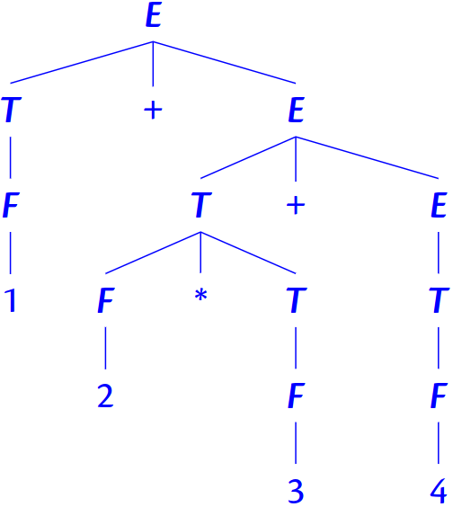

- While regular expressions are very useful for lexing, there is no regular expression that can recognise the language $a^nb^n$.
- (((()()))()) vs. (((()()))()))
- So we cannot find out with regular expressions whether parentheses are matched or unmatched. Also regular expressions are not recursive, e.g. (1 + 2) + 3.
-
- Computer languages are often context free. We can use grammars to describe them.
- A grammar for palindromes over the alphabet {a, b}:
	- S ::= a · S · a
	- S ::= b · S · b
	- S ::= a
	- S ::= b
	- S ::= ϵ
	- Can be compacted like:
		- S ::= a · S · a | b · S · b | a | b | ϵ
- Grammar for Arithmetic Expressions:
	- E ::= 0 | 1 | 2 | ... | 9 | E · + · E | E · − · E | E · * · E | (·E·)
- A CFG Derivation #numlist
	- Begin with a string containing only the start symbol, say S
	- Replace any nonterminal X in the string by the
	  right-hand side of some production X ::= rhs
	- Repeat 2 until there are no non terminals left: S → . . . → . . . → . . . → . . .
-
- Example Derivation:
	- S ::= ϵ | a · S · a | b · S · b
	- S → aSa
	- → abSba
	- → abaSaba
	- → abaaba
- Example Derivation:
	- E ::= 0 | 1 | 2 | ... | 9 | E · + · E | E · − · E | E · *· E | (·E·)
	- E → E * E
	- E + E * E
	- → E + E * E + E
	- →+ 1 + 2 * 3 + 4
- Alternative Derivation:
	- E → E + E
	- → E + E + E
	- → E + E * E + E
	- →+ 1 + 2 * 3 + 4
- We don't like when there is more than one way to derive a grammar. It should be avoided to use an ambiguous grammar.
- Instead for arithmetic expressions we use the following grammar:
	- E ::= T | T · + · E | T · − · E
	- T ::= F | F · * · T
	- F ::= 0...9 | (·E·)
- using this we follow bidmas.
- For 1+2*3+4 we follow this:
- 
- Using priorities will resolve the ambiguity
-
- ‘Dangling’ Else
- Another ambiguous grammar:
	- E → if E then E | if E then E else E | …
	- "if a then if x then y else c"
	- Which if does the else belong to?
-
- Chomsky Normal Form:
	- A grammar for palindromes over the alphabet {a, b}:
	- S ::= a · S · a | b · S · b | a · a | b · b | a | b
	- In Chomsky normal form:
		- S$_a$ := a
		- S$_b$ := b
		- S$_1$ :=S$_a$ · S
		- S$_2$ :=S$_b$ · S
		- S ::= S$_1$ · S$_a$ | S$_2$ · S$_b$ | S$_a$ · S$_a$ | S$_b$ · S$_b$ | a | b
-