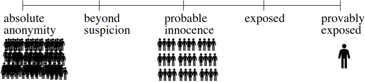

- Information security means protecting information and information systems from unauthorized access, use, disclosure, disruption, modification, or destruction.
-
- What is cryptography?
	- Cryptology: the study of secret writing.
	- Steganography: the science of hiding messages in other messages.
	- Cryptography: the science of secret writing. Note: terms like encrypt, encode, and encipher are often (loosely and wrongly) used interchangeably.
	- Cryptanalysis: science of recovering the plaintext from ciphertext without the key.
-
- Common security properties spell out the acronym CIA:
	- Confidentiality (Secrecy): No improper disclosure of information.
	- Integrity: No improper modification of information.
	- Availability: No improper impairment of functionality/service.
-
- Anonymity:
	- You are only anonymous within a group if your actions (sending, receiving, communication relationships) cannot be distinguished from the actions of anyone else in a group.
	- This group is called the anonymity set. The larger, the better.
	- 
	- You cannot be anonymous by yourself!
	- Anonymity is the state of being not identifiable
	  within a set of subjects.
-
- Availability:
	- Data or services can be accessed in a reliable and timely way
	- Threats to availability cover many kinds of external environmental events (e.g., fire, pulling the server plug) as well as accidental or malicious attacks in software (e.g., infecting a system with a debilitating virus).
	- Ensuring availability means preventing denial of service (DoS) attacks, insofar as this is possible. It’s possible to fix attacks on faulty protocols, but attacks exhausting available resources are harder, since it can be tricky to distinguish between an attack and a legitimate use of the service.
	- Example violations: the deadly distributed DoS (DDoS) attacks against on-line services; interfering with IP routing.
-
- Authentication:
	- Data or services available only to authorized identities
	- Authentication is verification of identity of a person or system.
	- Some form of authentication is a pre-requisite if we wish to allow access to services or data to some people but deny access to others, using an access control system.
	- Methods for authentication are often characterised as:
		- something you have, e.g. an entrycard, or an auth code device
		- something you know, e.g. a password or secret key, or
		- something you are, e.g. a fingerprint, signature, biometric.
	- Also, where you are may be implicitly or explicitly checked. Several methods can be combined for extra security.
	- Examples of violation: purporting to be somebody else (identity theft) by faking email, IP spoofing, or stealing a private key and signing documents.